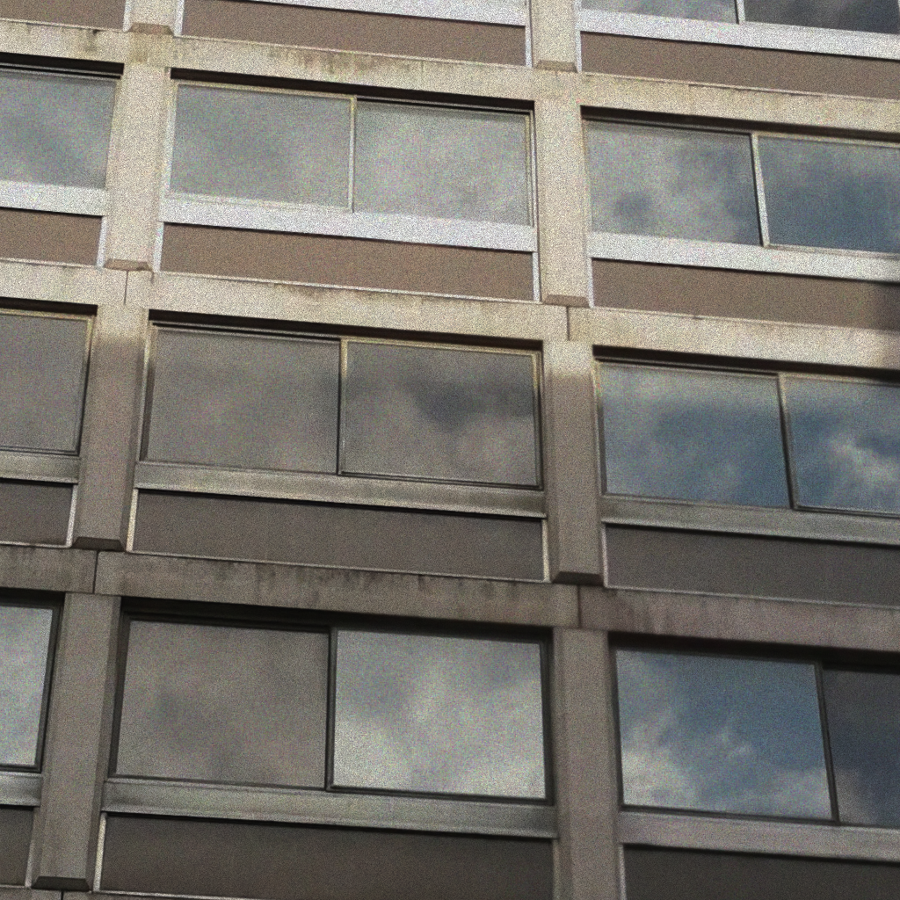
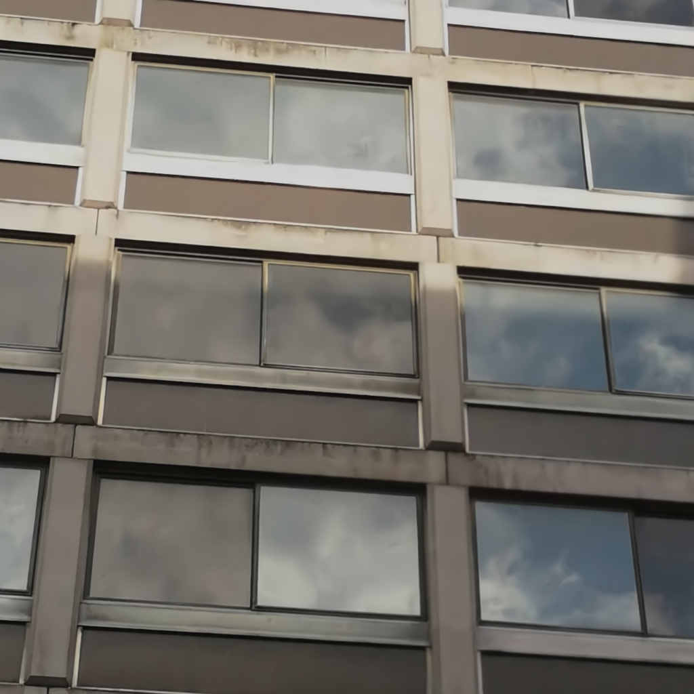
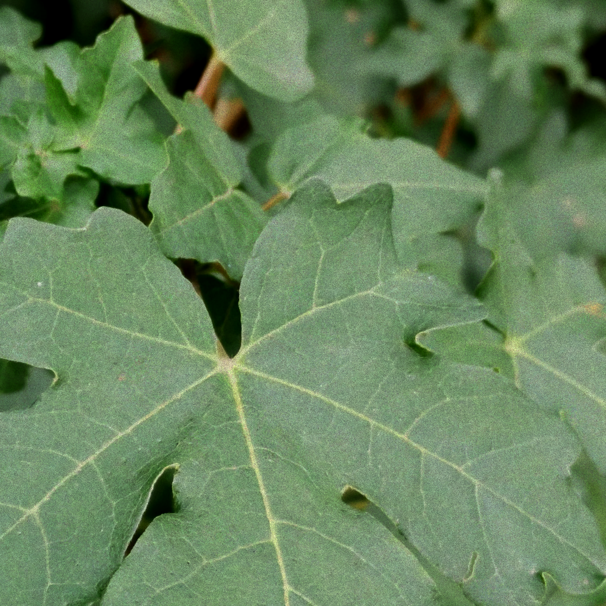
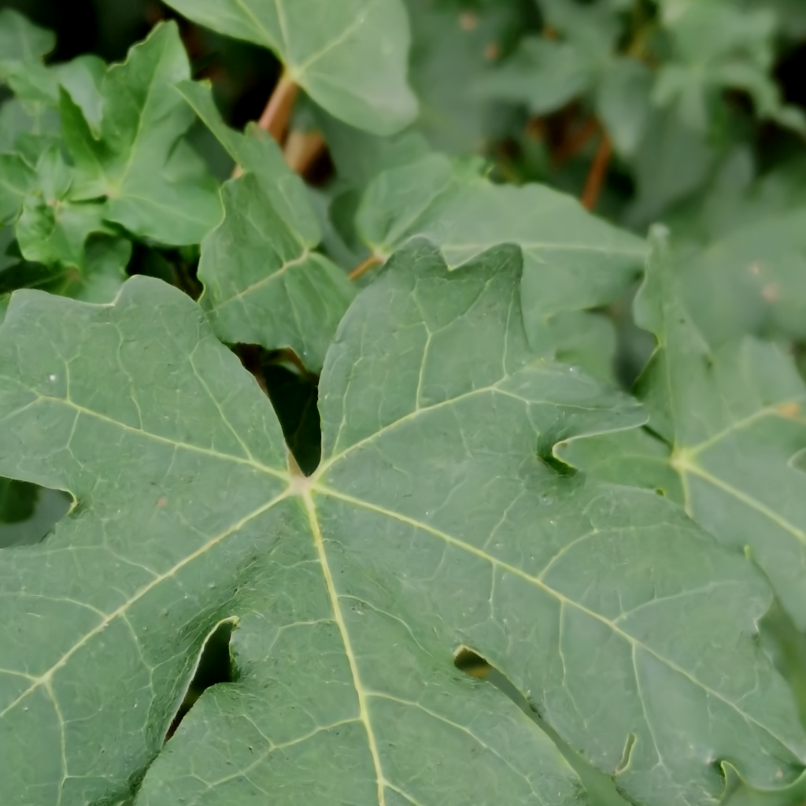
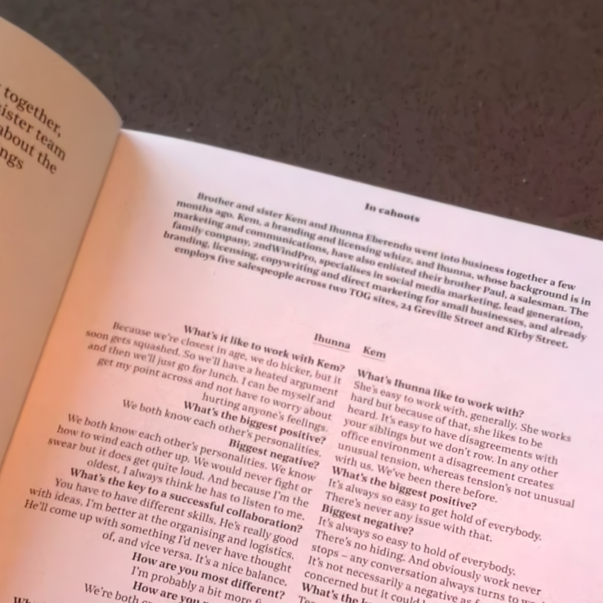

# Digital Camera Image Denoising Using Metadata

Fully-convolutional image denoiser incorporating camera ISO values as conditional information.


## Requirements

* Python 3.6
* PyTorch >= 0.4
* tqdm
* tensorboardX
* torchnet


## Usage
There are two scripts provided: one for runnning a regular fully-convolutional model
and one specific to a GAN architecture.

Running the regular one:

```shell
python main.py [path to config file]
```

If no config file is specified, the default config file in `run_configs/default.ini`
is used.

for GAN:

```shell
python main_gan.py [path to config file]
```

The default config file for the GAN architecture is `run_configs/default_gan.ini`.

If you want to use your own configuration, modify the config for the relevant
model in a duplicate config file. Explanations of the various parameters are provided in the
comments in the config files.

## Dataset

The dataset comprised of three image classes: buildings, foliage, and text.
Sample denoised images are shown in the table below.

| Noisy  | Cleaned |
| ------------- | ------------- |
|  |  |
|    |    |
|          |          |

